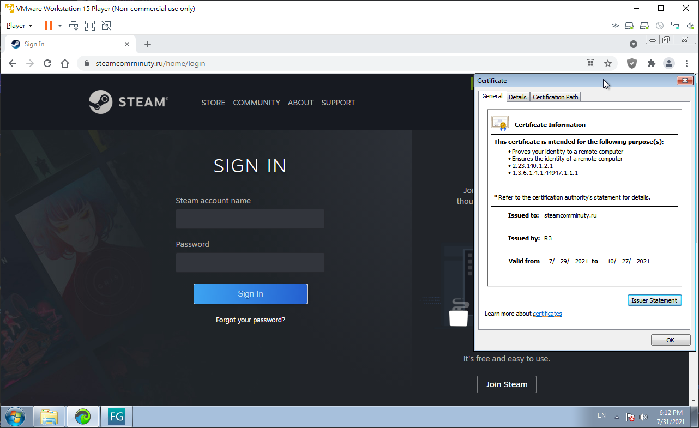

# Steam Anti-Phish Spammer
Spamming against a Russian Steam phishing campaign websites.

## Brief Intro
Screenshot of a malicious Discord spam message posted by a compromised account:

Screenshot of the malicious website's phishing interface:

## WARNING: Do NOT use/modify this tool against innocent websites.
I uploaded the script just for ppls to spam malicious sites only, in effort of taking those scumbags down, rendering their service unavailable, or at least putting some stress on their servers to maybe slow down their malicious attacks.

## Usage
First, `cd` to `/path/to/directory/of/package`, and do `npm install` to install dependencies.  
After that, simply do `node /path/to/directory/of/package`.  
You may like to modify the settings section in the script to spam new servers with different setup.
  
**ATTENTION:** You should ONLY run this script under sandboxed environments with proper VPN settings. `Node.js >= 11.7.0` is required.  
  
### Miscellaneous
There are three servers alive listed in the comments within the settings section (in `main.js`). Feel free to spam all of the three or even add your own ones.  
  
## Change Log
Link to the [change log](changelog.md).  
